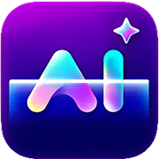

# RenderShot AI

<div align="center">
  
  
  <h3>Transform Your Product Photos with AI Magic</h3>
  
  <p>Professional product photography made simple. Generate stunning visuals, lifestyle shots, and marketing images from a single photo using advanced AI technology.</p>
  
  [](https://opensource.org/licenses/MIT)
  [](https://www.typescriptlang.org/)
  [](https://reactjs.org/)
  [](https://vitejs.dev/)
</div>

## 🚀 Features

### Three Powerful AI Studios

- **🎬 Virtual Photoshoot Studio** - Create professional studio-quality product photos with AI-powered backgrounds and lighting
- **👥 Virtual Models Studio** - Generate lifestyle shots with AI models showcasing your products across diverse demographics
- **📱 UGC-Style Studio** - Create authentic user-generated content that converts with natural, engaging product photography

## 🎨 Template Library

- **Ad Poster** - Premium ad poster with dramatic lighting
- **Miniature on Desk** - Realistic 1/7‑scale miniature on a desk
- **Retro Ad Poster** - Authentic retro-era advertising style
- **Miniature in Hand** - photo of a hyper‑detailed miniature between fingers

### Key Capabilities

- ✨ **One Photo, Infinite Possibilities** - Transform a single product photo into multiple professional visuals
- 🎨 **Multiple Aspect Ratios** - Generate images optimized for all social media platforms and marketing channels
- ⚡ **Lightning Fast** - Generate professional-quality images in seconds, not weeks
- 💰 **Cost Effective** - Reduce photography costs by up to 90%
- 🎯 **No Design Experience Required** - Intuitive interface designed for everyone
- 🔧 **Customizable Settings** - Fine-tune backgrounds, lighting, camera angles, and more

## 🛠️ Technology Stack

### Frontend
- **React 18** - Modern UI library
- **TypeScript** - Type-safe development
- **Vite** - Fast build tool and dev server
- **Tailwind CSS** - Utility-first CSS framework
- **shadcn/ui** - Beautiful, accessible UI components
- **React Router** - Client-side routing

### AI & Backend
- **Google Gemini 2.5 Flash** - Advanced AI image generation
- **Express.js** - Backend server
- **CORS** - Cross-origin resource sharing

### Development Tools
- **ESLint** - Code linting
- **PostCSS** - CSS processing
- **Concurrently** - Run multiple commands

## 📦 Installation & Setup

### Prerequisites

- Node.js (v16 or higher)
- npm or yarn package manager
- Google AI Studio API key

### 1. Clone the Repository

```bash
git clone https://github.com/joy-deb-nath/rendershot-ai.git
cd rendershot-ai
```

### 2. Install Dependencies

```bash
npm install
# or
yarn install
```

### 3. Environment Setup

Create a `.env.local` file in the root directory:

```bash
# .env.local
VITE_GEMINI_API_KEY=your_actual_api_key_here
```

**Get your API key from [Google AI Studio](https://aistudio.google.com/app/apikey)**

### 4. Start Development Server

```bash
# Start both frontend and backend
npm run dev:full

# Or start them separately
npm run dev        # Frontend only
npm run server     # Backend only
```

### 5. Build for Production

```bash
npm run build
npm run preview
```

## 🎯 Usage

1. **Upload Your Product Photo** - Start with any product image
2. **Choose Your Studio** - Select from Virtual Photoshoot, Virtual Models, or UGC-Style
3. **Customize Settings** - Adjust backgrounds, lighting, camera angles, and more
4. **Generate Images** - Watch AI create professional visuals in seconds
5. **Download & Use** - Save your generated images for marketing campaigns


## 📄 License

This project is licensed under the MIT License - see the [LICENSE](LICENSE) file for details.

## 👨‍💻 Author

**Joy Deb Nath**
- Website: [www.joydebnath.org](https://www.joydebnath.org)
- Email: [hello@joydebnath.org](mailto:hello@joydebnath.org)
- GitHub: [@joy-deb-nath](https://github.com/joy-deb-nath)

## 🙏 Acknowledgments

- Google AI Studio for providing the Gemini 2.5 Flash API
- shadcn/ui for the beautiful component library
- The React and TypeScript communities for excellent tooling

---

<div align="center">
  <p>Made with ❤️ by <a href="https://www.joydebnath.org">Joy Deb Nath</a></p>
</div>


